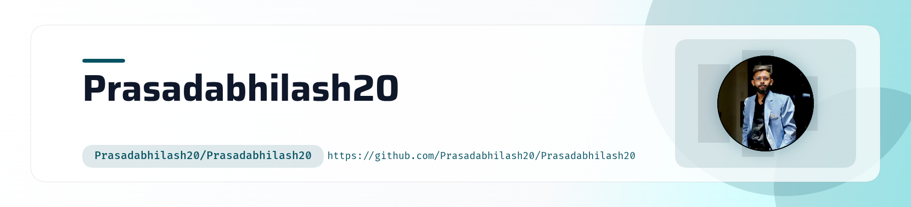

<!-- ========================================================= -->
<!--                    PROFILE BANNER                         -->
<!-- ========================================================= -->

  <picture>
    <source
      media="(prefers-color-scheme: dark)"
      srcset="./assets/banner-dark.png"
    />
    <source
      media="(prefers-color-scheme: light)"
      srcset="./assets/banner-light.png"
    />
    
  </picture>

<!-- ========================================================= -->
<!--                       INTRO                               -->
<!-- ========================================================= -->

<h1 align="center">
  Hey there, I'm ABHILASH PRASAD 👋
</h1>

  

  
  
  

---

<!-- ========================================================= -->
<!--                      ABOUT ME                             -->
<!-- ========================================================= -->

## 👨‍💻 About Me

<table>
<tr>
<td width="65%" valign="top">

### 👋 Hi, I'm Abhilash Prasad

🎓 **Computer Science Engineering graduate** passionate about building practical and scalable software solutions.

💻 I work with **Python, Django, HTML, CSS, JavaScript, SQL, Git and GitHub**, with a strong interest in backend and web development.

🛠️ I also have hands-on experience in **IT Support**, including hardware/software troubleshooting, OS installation, system maintenance, software configuration and technical support.

🚀 I enjoy building real-world applications and continuously improving my programming, problem-solving and development skills.

### 🎯 Currently Learning

- Advanced Django
- REST APIs
- Data Structures & Algorithms
- Backend Development
- Linux
- DevOps fundamentals

### 💼 Open To

**Python/Django Development • Backend Development • Software Engineering • IT Support**

</td>

<td width="35%" align="center" valign="middle">

</td>
</tr>
</table>

---

<!-- ========================================================= -->
<!--                     TECH STACK                            -->
<!-- ========================================================= -->

## 🛠️ Tech Stack

<h3 align="left">💻 Programming Languages</h3>

  
  &nbsp;&nbsp;&nbsp;
  
  &nbsp;&nbsp;&nbsp;
  

<h3 align="left">🌐 Web Development</h3>

  
  &nbsp;&nbsp;&nbsp;
  
  &nbsp;&nbsp;&nbsp;
  
  &nbsp;&nbsp;&nbsp;
  

<h3 align="left">⚙️ Framework & Backend</h3>

  

<h3 align="left">🗄️ Databases</h3>

  
  &nbsp;&nbsp;&nbsp;
  
  &nbsp;&nbsp;&nbsp;
  

<h3 align="left">📊 Data & Analytics</h3>

  
  &nbsp;&nbsp;
  
  &nbsp;&nbsp;
  

<h3 align="left">🔧 Tools & Platforms</h3>

  
  &nbsp;&nbsp;&nbsp;
  
  &nbsp;&nbsp;&nbsp;
  

<h3 align="left">🐧 Operating Systems</h3>

  
  &nbsp;&nbsp;&nbsp;
  

<h3 align="left">🧠 Core Concepts</h3>

  
  &nbsp;&nbsp;
  
  &nbsp;&nbsp;
  

---

<!-- ========================================================= -->
<!--                     EXPERIENCE                            -->
<!-- ========================================================= -->

## 💼 Experience

### 🖥️ Graphic Design & IT Support
**Webdoid Technologies — Bhopal**

- Created logos, posters and digital creatives for branding and marketing.
- Worked with digital signatures and system maintenance.
- Performed software installation, configuration and updates.
- Troubleshot hardware and software issues.
- Performed disk cleanup and system performance troubleshooting.
- Assisted with backup and recovery tasks.

### 🔧 IT Support Trainee
**Bharat Heavy Electricals Limited (BHEL) — Bhopal**

- Desktop and laptop deployment.
- Operating system, software, driver and antivirus installation.
- Hardware and software troubleshooting.
- System maintenance and updates.
- Performance monitoring and technical issue documentation.

---

<!-- ========================================================= -->
<!--                    FEATURED PROJECTS                       -->
<!-- ========================================================= -->

## 🚀 Featured Projects

<table>
<tr>
<td width="50%" valign="top">

### 🏫 Shikayat Saathi

**College Complaint Management System**

A Django-based complaint management prototype designed to digitize complaint registration, tracking, assignment and escalation.

**Tech:**

`Python` `Django` `HTML` `CSS` `Bootstrap` `JavaScript` `SQLite`

</td>

<td width="50%" valign="top">

### 🐙 GitHub Profile Update

A continuously improved GitHub profile showcasing my development journey, projects, technical skills and contributions.

**Focus:**

`GitHub` `Markdown` `GitHub Actions` `Profile Development`

 

</td>
</tr>
</table>

---

<!-- ========================================================= -->
<!--                  GITHUB ANALYTICS                         -->
<!-- ========================================================= -->

## 📊 GitHub Analytics

---

<!-- ========================================================= -->
<!--                    GITHUB STREAK                          -->
<!-- ========================================================= -->

## 🔥 GitHub Streak

---

<!-- ========================================================= -->
<!--                  GITHUB ACTIVITY                          -->
<!-- ========================================================= -->

## 📈 GitHub Activity

  

---

<!-- ========================================================= -->
<!--                 CONTRIBUTION SNAKE                        -->
<!-- ========================================================= -->

## 🐍 Contribution Snake

<picture>
  <source
    media="(prefers-color-scheme: dark)"
    srcset="https://raw.githubusercontent.com/Prasadabhilash20/Prasadabhilash20/gh-pages/github-contribution-grid-snake-dark.svg"
  />

  <source
    media="(prefers-color-scheme: light)"
    srcset="https://raw.githubusercontent.com/Prasadabhilash20/Prasadabhilash20/gh-pages/github-contribution-grid-snake.svg"
  />

  

</picture>

---

<!-- ========================================================= -->
<!--                   GITHUB ACTION                           -->
<!-- ========================================================= -->

<!--
IMPORTANT:
Create this file:

.github/workflows/snake.yml

Use the following workflow:

name: Generate GitHub Contribution Snake

on:
  schedule:
    - cron: "0 0 * * *"

  workflow_dispatch:

  push:
    branches:
      - main

permissions:
  contents: write

jobs:
  generate:
    runs-on: ubuntu-latest

    steps:
      - name: Generate contribution snake
        uses: Platane/snk@v3
        with:
          github_user_name: Prasadabhilash20
          outputs: |
            dist/github-snake.svg?color_snake=#38BDF8&color_dots=#0EA5E9,#7DD3FC,#38BDF8,#0EA5E9,#38BDF8
            dist/github-snake-dark.svg?palette=github-dark&color_snake=#38BDF8&color_dots=#0EA5E9,#7DD3FC,#38BDF8,#0EA5E9,#38BDF8

      - name: Publish snake to output branch
        uses: crazy-max/ghaction-github-pages@v4
        with:
          target_branch: output
          build_dir: dist
        env:
          GITHUB_TOKEN: ${{ secrets.GITHUB_TOKEN }}
-->

---

<!-- ========================================================= -->
<!--                     CONNECT                              -->
<!-- ========================================================= -->

## 🤝 Let's Connect

---

<!-- ========================================================= -->
<!--                       FOOTER                              -->
<!-- ========================================================= -->

  

